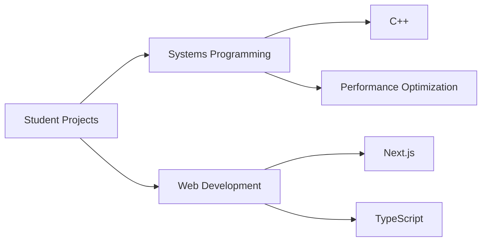

<div align="center">

# Hey there! I'm Christian 👋
[](https://github.com/Muddyblack)
[](https://github.com/Muddyblack)

*Full Stack Developer | Student Developer | 🇩🇪 🇫🇷 🇬🇧*
</div>

```typescript
const christian = {
    location: "Germany/France",
    occupation: "Dual System Student",
    tech: ["Python", "TypeScript", "C++", "Next.js"],
    languages: ["German", "French", "English"],
    focus: "Full Stack Development & Systems Programming"
};
```

### 🛠️ Tech Stack
```
Frontend: Next.js • React • TypeScript • TailwindCSS
Backend:  Python • Node.js • C++ • RESTful APIs
Tools:    MongoDB • PostgreSQL • Docker • Git
```

[](https://github.com/Muddyblack)

<details>
<summary>📚 More About Me</summary>

## 📊 Current Focus Areas


## 🎮 Fun facts
```javascript
const developmentStyle = {
    favoriteEditor: "VS Code with vim keybindings",
    debuggingTool: "console.log('🔍')",
    architecturePhilosophy: "KISS - Keep It Simple, Stupid",
    motto: "It's not a bug, it's an undocumented feature!"
};
```

## 🎯 Current Learning Goals
- Advanced System Design Patterns
- Cloud Architecture (AWS/GCP)
- Performance Optimization Techniques
- Microservices Architecture

## 💡 Featured Projects
| Project Type | Tech Stack | Status |
|-------------|------------|---------|
| System Tools | C++, CMake | 🟢 Active |
| Web Apps | Next.js, TypeScript | 🟢 Active |
| Backend Services | Python, Node.js | 🟡 Maintenance |

**Daily Schedule**
```text
🌙 Night    ⣿⣿⣿⣿⣿⣿⣿⣿⣿⣿⣀⣀⣀⣀⣀⣀⣀⣀  43%
🌅 Morning  ⣿⣿⣿⣿⣿⣿⣿⣀⣀⣀⣀⣀⣀⣀⣀⣀⣀⣀  30%
🌃 Evening  ⣿⣿⣿⣿⣿⣀⣀⣀⣀⣀⣀⣀⣀⣀⣀⣀⣀⣀  22%
🌙 Day      ⣿⣿⣀⣀⣀⣀⣀⣀⣀⣀⣀⣀⣀⣀⣀⣀⣀⣀  5%
```
</details>

## 📫 Let's Connect

<div align="center">
    
*"There are two ways to write error-free programs; only the third works." - Alan J. Perlis*

</div>

---
<div align="center">
<sub>💡 Currently learning and growing through dual studies system</sub>
</div>

