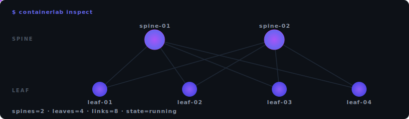

<div align="center">

<a href="https://github.com/Muddyblack">
  
</a>

<br/>



<br/>

[](https://github.com/Muddyblack)

🇩🇪 &nbsp; 🇫🇷 &nbsp; 🇬🇧

</div>

<p align="center"></p>

### whoami

```yaml
based:    Germany / France
vibe:     hobby dev · network enthusiast · linux tinkerer
into:     nixos, desktop ricing, automation, making things just work
```

### stack

```text
systems      nixos · linux · docker · kubernetes · ansible
web          next.js · react · typescript · tailwind
backend      python · node.js · go (learning)
networking   containerlab · netlab · frr · cisco · nokia srl · gnmi
observ.      grafana · prometheus · streaming telemetry
data         postgres · mongodb
```

### stats

<div align="center">

<a href="https://github.com/Muddyblack">
  
</a>

<br/><br/>

<a href="https://github.com/Muddyblack">
  
</a>

<br/><br/>

<div align="center">
  
</div>

</div>

<details>
<summary><b>more</b></summary>

<br/>

<a href="https://github.com/Muddyblack">
  
</a>

<br/>

```ts
const workflow = {
  editor:     "vim + antigravity + claude",
  debugger:   "console.log('🔍')",
  philosophy: "KISS — keep it simple, stupid",
  motto:      "it's not a bug, it's an undocumented feature",
};
```

</details>

<p align="center"></p>

<div align="center">

*"There are two ways to write error-free programs; only the third works."* — Alan J. Perlis

</div>
