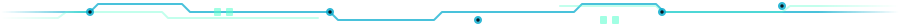

<!-- The card is real SVG <text>, not a bitmap — but a browser will not let you
     select text inside an . Linking to the raw file opens it as a document,
     where it is selectable and searchable. -->

 
 

 

*"There are two ways to write error-free programs; only the third works."* — Alan J. Perlis

<!-- komarev counts a view by being fetched, so it only keeps counting while
     something here still requests it. Kept at 1x1 rather than removed: the
     tally carries on climbing in the background, so if this ever goes back to
     being a visible badge it picks up from a real number instead of restarting.
     Do not delete unless you are happy to lose the count. -->

